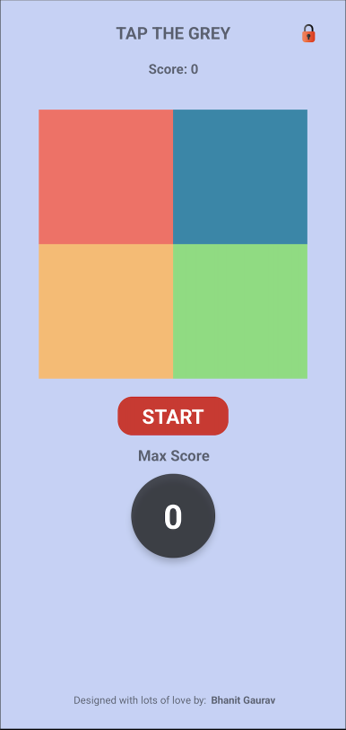
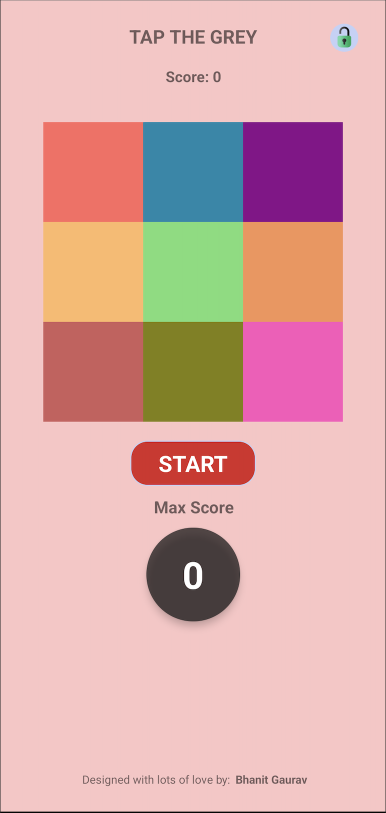
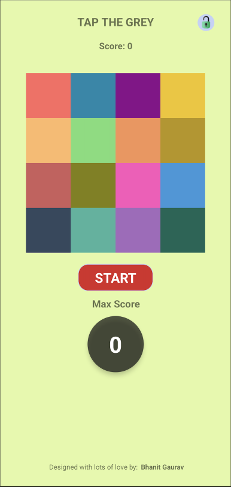
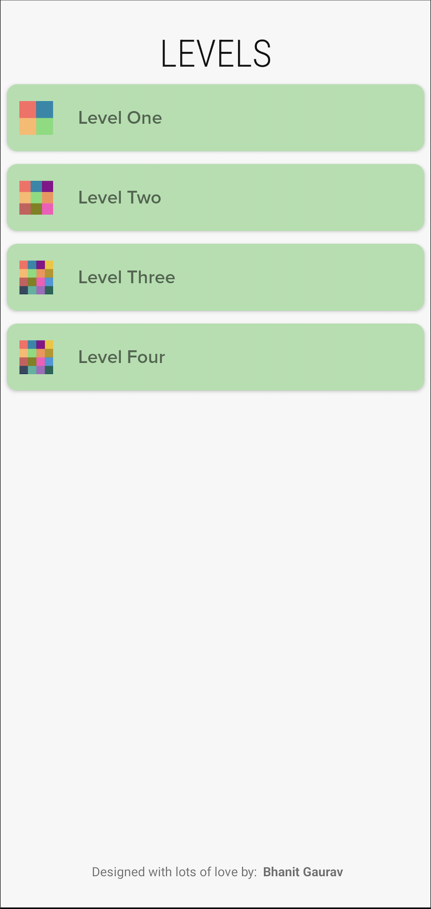

# TAP THE GREY

TAP THE GREY is a simple yet engaging static game designed to improve concentration and focus. The
objective is to tap the grey block before it reverts to its original color, challenging players'
reflexes and precision. With its minimalist gameplay, TAP THE GREY offers a fun and rewarding
experience for all ages.

## Features

- **Focus and Coordination**: Enhance your attention and hand-eye coordination by tapping the
  changing grey block in time.
- **Minimalist Gameplay**: Simple and intuitive mechanics make it easy to pick up and play.
- **Engaging Challenge**: Stay attentive as blocks change quickly, testing your reflexes.

## Built With

- **Kotlin**: Leveraging the power of Kotlin for clean and efficient Android app development.
- **Android**: Optimized for Android devices to deliver a seamless gaming experience.

## Getting Started

Follow these steps to get the TAP THE GREY game running on your local machine:

### Prerequisites

- Android Studio installed on your machine
- Android SDK with a minimum API level of 24

### Installation

1. Clone the repository:
   ```bash
   git clone https://github.com/bhanitgaurav/TAP_THE_GREY.git
   ```
2. Open the project in Android Studio.
3. Build the project and ensure all dependencies are resolved.
4. Run the app on an emulator or a connected Android device.

## How to Play

1. Open the game and start playing.
2. Tap the grey block as soon as it appears, before it changes back to its original color.
3. Keep playing to improve your focus and reflexes!

## Download

Get the game on the Google Play Store:
[Download TAP THE GREY](https://play.google.com/store/apps/details?id=com.bhanit.games.tapthegrey)

Visit the official website:
[Visit TAP THE GREY Website](https://www.bhanit.com/tapthegrey)

## Screenshots

Here are some sample images from the game:






## Contributing

Contributions are welcome! Feel free to fork this repository, make improvements, and submit a pull
request.

## License

This project is licensed under the TAPTHEGREY License. See the [LICENSE](LICENSE.txt) file for
details.

## Contact

For any inquiries or feedback, reach out to:

- **Bhanit Gaurav**: [bhanitgauravapps@gmail.com](mailto:bhanitgauravapps@gmail.com)
- [LinkedIn](https://www.linkedin.com/in/bhanitgaurav)
- [WEBSITE](https://www.bhanit.com)
